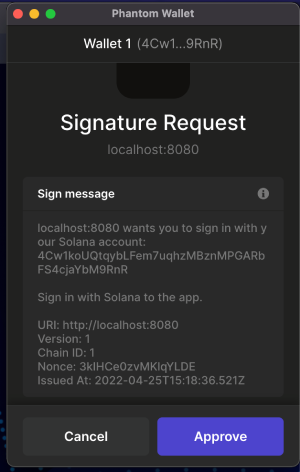
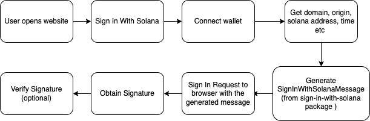

# Sign In With Solana

The primary purpose of this document is to define how Solana accounts authenticate with off-chain services. By signing a standard message format parameterized by scope, session details, and a nonce. 

While decentralized identity is not a novel concept, the most common implementations of blockchain-based credentials are either certificate-based or rely on centralized providers. We're proposing an alternative that doesn't require a trusted third party.

### Specification
The specification for Sign In With Solana is based on https://eips.ethereum.org/EIPS/eip-4361 with the intention to make it compatible with https://github.com/ChainAgnostic/CAIPs/blob/master/CAIPs/caip-74.md

The message created follows the following structure :- 

#### CACAO

```
  header: Headers;

  payload: Payload;

  signature: Signature;
```

#### Payload

```
  /** RFC 4501 dns authority that is requesting the signing. */
  domain: string;

  /** Solana address performing the signing */
  address: string;

  /** Human-readable ASCII assertion that the user will sign, and it must not contain newline characters. */
  statement?: string;

  /** RFC 3986 URI referring to the resource that is the subject of the signing
   *  (as in the __subject__ of a claim). */
  uri: string;

  /** Current version of the message. */
  version: string;

  /** Chain ID to which the session is bound, and the network where
   * Contract Accounts must be resolved. */
  chainId?: number;

  /** Randomized token used to prevent replay attacks, at least 8 alphanumeric
   * characters. */
  nonce: string;

  /** ISO 8601 datetime string of the current time. */
  issuedAt: string;

  /** ISO 8601 datetime string that, if present, indicates when the signed
   * authentication message is no longer valid. */
  expirationTime?: string;

  /** ISO 8601 datetime string that, if present, indicates when the signed
   * authentication message will become valid. */
  notBefore?: string;

  /** System-specific identifier that may be used to uniquely refer to the
   * sign-in request. */
  requestId?: string;

  /** List of information or references to information the user wishes to have
   * resolved as part of authentication by the relying party. They are
   * expressed as RFC 3986 URIs separated by `\n- `. */
  resources?: Array<string>;
```

#### Signature

```
  t: string; // signature scheme

  m?: SignatureMeta; // signature related metadata (optional)

  s: string; // signature
```


A sample sign in message would look like :- 

```
localhost:8080 wants you to sign in with your Solana account:
4Cw1koUQtqybLFem7uqhzMBznMPGARbFS4cjaYbM9RnR

Sign in with Solana to the app.

URI: http://localhost:8080
Version: 1
Chain ID: 1
Nonce: zNTPldYfb8ESmhPmL
Issued At: 2022-04-25T14:51:12.040Z
```




### Workflow

1. The user connects the wallet to the website. 
2. From the frontend pass the domain, address, statement, uri, version, nonce, issuedAt, expirationTime, notBefore, requestId, resources (Array) to the SignInWithSolanaMessage constructor. There is additional regex validation in place as mentioned in the below sections
3. Nonce is needed as a security mechanism from replay attacks and hence it is generated at the server side.
4. The created message needs to be prepared in a wallet friendly format for which <message>.prepareMessage() needs to be called
5. The resultant has to be passed to signMessage method of window.solana.request
6. This function would return the signedMessage

#### Regex rules
Each field specified in the Specification section needs to follow the following regex rules
```
DOMAIN = "(?<domain>([^?#]*)) wants you to sign in with your Solana account:";
ADDRESS = "\\n(?<address>[a-zA-Z0-9]{32,44})\\n\\n";
STATEMENT = "((?<statement>[^\\n]+)\\n)?";
URI = "(([^:?#]+):)?(([^?#]*))?([^?#]*)(\\?([^#]*))?(#(.*))";
URI_LINE = `\\nURI: (?<uri>${URI}?)`;
VERSION = "\\nVersion: (?<version>1)";
CHAIN_ID = "\\nChain ID: (?<chainId>[0-9]+)";
NONCE = "\\nNonce: (?<nonce>[a-zA-Z0-9]{8,})";
DATETIME = `([0-9]+)-(0[1-9]|1[012])-(0[1-9]|[12][0-9]|3[01])[Tt]([01][0-9]|2[0-3]):([0-5][0-9]):([0-5][0-9]|60)(.[0-9]+)?(([Zz])|([+|-]([01][0-9]|2[0-3]):[0-5][0-9]))`;
ISSUED_AT = `\\nIssued At: (?<issuedAt>${DATETIME})`;
EXPIRATION_TIME = `(\\nExpiration Time: (?<expirationTime>${DATETIME}))?`;
NOT_BEFORE = `(\\nNot Before: (?<notBefore>${DATETIME}))?`;
REQUEST_ID = "(\\nRequest ID: (?<requestId>[-._~!$&'()*+,;=:@%a-zA-Z0-9]*))?";
RESOURCES = `(\\nResources:(?<resources>(\\n- ${URI}?)+))?`;
```

### Verification flow

The verify function takes in the following params (as VerifyParams)
```
signature
publicKey
domain
nonce
time (optional)
```
There are certain checks in place such as invalid domain check,nonce binding check, expiry checks etc
```
import nacl from "tweetnacl";
.
.
nacl.sign.detached.verify(encodedMessage, base58.decode(signature), base58.decode(publicKey))
```
If this function returns a true value then it is a valid signature


### User flow



#### Disclaimer : 
We haven't undergone a Formal Security Audit yet.

